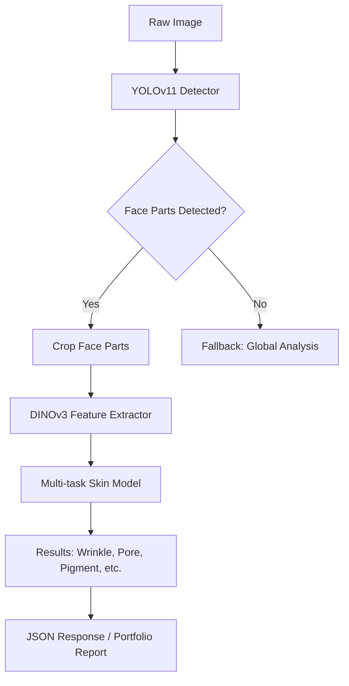
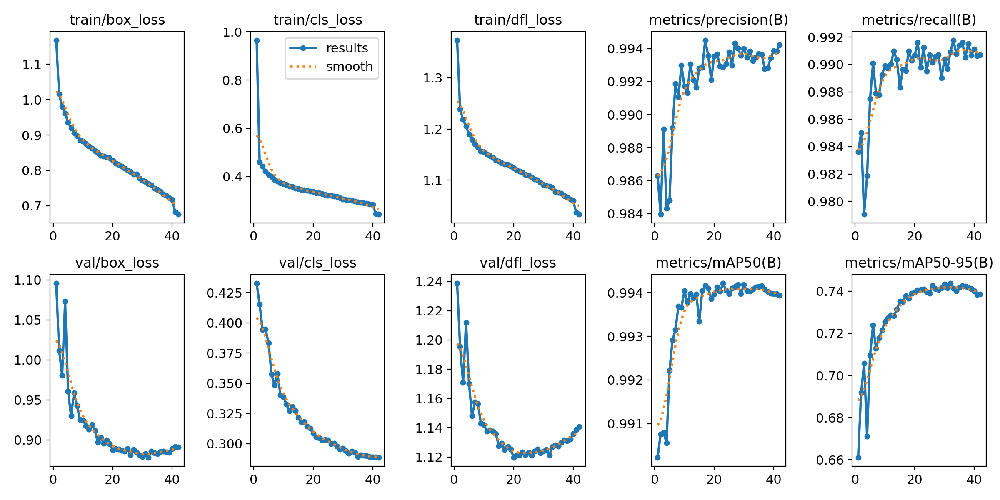
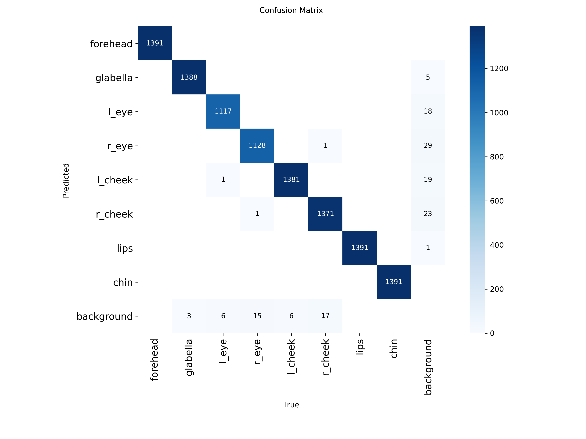
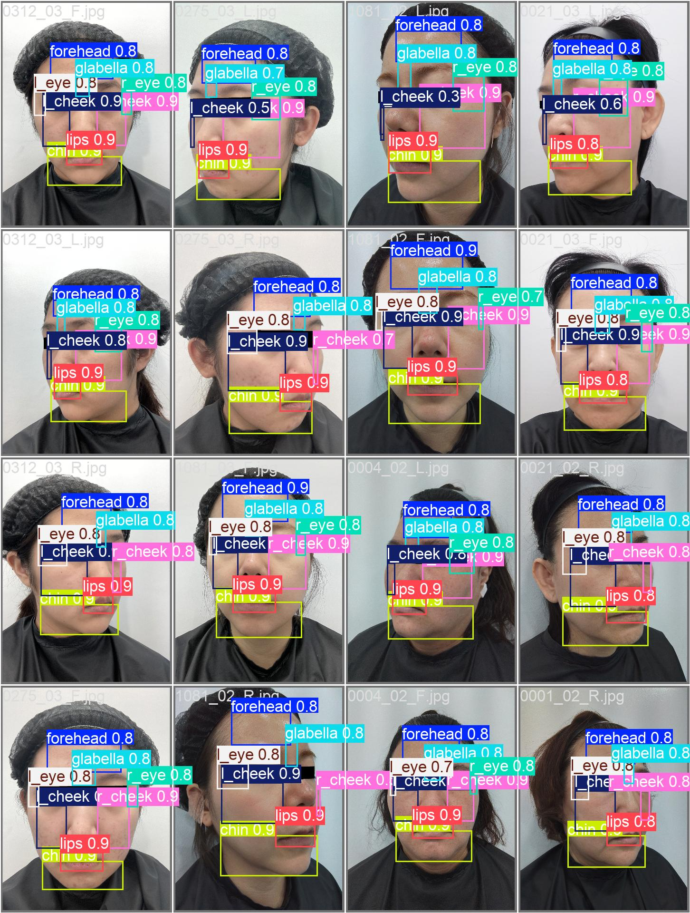

# DeepSkin: End-to-End Face Analysis AI 🧬


**DeepSkin**은 사용자의 얼굴 이미지를 분석하여 부위별(이마, 눈가, 볼 등) 피부 상태를 정밀하게 진단하고 수치화하는 딥러닝 기반 AI 솔루션입니다. 본 프로젝트에서 저는 **얼굴 부위 검출 모델 학습, 피부 상태 분석 모델 학습, 전체 AI 파이프라인 설계 및 추론 서버 구현**을 담당했습니다.

---

## 🚀 Key Contributions

### 1. High-Precision Face Part Detection (YOLOv11)
얼굴의 각 부위를 정밀하게 타겟팅하기 위해 YOLOv11 모델을 활용하여 8개 주요 부위(이마, 미간, 눈가, 볼, 입술, 턱 등)를 검출하는 모델을 학습시켰습니다.
- **Model:** YOLO11s (Ultralytics)
- **Optimization:** 고해상도 학습(`imgsz=1280`), 다양한 증강 기법 적용.
- **Performance:** mAP50 기준 **99% 이상의 정확도** 달성.
- **Role:** 데이터 전처리(YOLO 포맷 변환), 하이퍼파라미터 튜닝, 모델 학습 및 검증.

### 2. Multi-task Skin Assessment (DINOv3 + Custom Heads)
검출된 각 부위의 특징을 추출하고, 주름, 색소침착, 모공, 수분도, 탄성 등 수십 개의 지표를 한 번에 예측하는 멀티태스크 모델을 구축했습니다.
- **Backbone:** DINOv3 (ViT-S/14) - Self-supervised learning 기반 고성능 특징 추출기.
- **Architecture:** 부위별 MLP Trunks + 지표별 특화 Heads (CORN Loss for Ordinal, Poisson for Count, Regression for Measurements).
- **Optimization:** Uncertainty Weighting을 통한 손실 함수 균형 조정, EMD Aux Loss 적용.
- **Role:** DINOv3 특징 추출 파이프라인 설계, 멀티태스크 학습 로직 구현, 모델 성능 최적화.

### 3. AI Pipeline Design & FastAPI Server
검출과 분석 모델을 유기적으로 결합한 End-to-End 파이프라인을 설계하고, 이를 실시간 서비스할 수 있는 고성능 서버를 구현했습니다.
- **Pipeline:** `Image Input` → `YOLO Detection` → `Feature Extraction` → `Multi-task Inference` → `Result Formatting`.
- **Server:** FastAPI 기반 비동기 추론 서버 구현.
- **Optimization:** TTA(Test Time Augmentation) 적용으로 예측 안정성 확보, 효율적인 GPU 메모리 관리.
- **Role:** 전체 시스템 아키텍처 설계, API 엔드포인트 구현, 데이터 후처리 로직 개발.

---

## 🛠 System Architecture



---

## 📊 Training Results

### YOLOv11 Face Part Detection
| Metric | Results |
| :--- | :--- |
| **mAP50** | > 0.99 |
| **Precision** | 0.98+ |
| **Recall** | 0.98+ |

<p align="center">
  
  
  <br>
  <i>YOLOv11 학습 결과 그래프 및 혼동 행렬</i>
</p>

### Detection Sample
<p align="center">
  
  <br>
  <i>AI가 실제로 검출한 얼굴 부위 바운딩 박스</i>
</p>

---

## 💻 Technical Stack
- **Languages:** Python 3.9+
- **Deep Learning:** PyTorch, Ultralytics(YOLO), DINOv3
- **Backend:** FastAPI, Uvicorn, Pydantic
- **Data:** Pandas, NumPy, PIL
- **DevOps/Tools:** Git, Mermaid.js

---

## 📂 Project Structure (AI Parts)
```text
📦 src
├── 🐍 crop.py              # YOLOv11 기반 얼굴 부위 검출/크롭
├── 🐍 model.py             # DINOv3 + Multi-task Head 모델 정의
├── 🐍 dataset.py           # 특징 기반 데이터셋 로더
├── 🐍 train.py             # 피부 분석 모델 학습 루프
├── 🐍 predict.py           # End-to-End 추론 파이프라인
└── 🐍 infer.py             # 추론 최적화 엔진
```

---

## 📝 Usage

### AI Inference Server Run
```bash
cd backend
python -m uvicorn scripts.multivalue_ai_server:app --port 9001
```

### API Endpoint
- `POST /inference/skin`: 이미지 업로드 시 부위별 검출 좌표와 피부 분석 결과를 JSON으로 반환.
